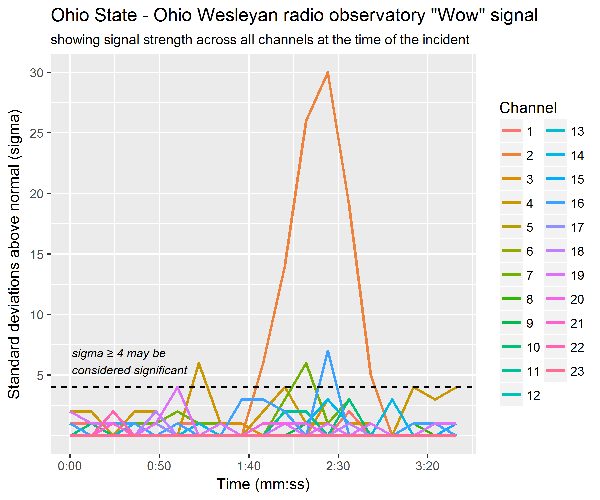

```{r setup, include=FALSE}
knitr::opts_chunk$set(echo = TRUE)
```

In this visualization I’ve converted the alphanumeric notation of signal strength into numeric 0-35 and plotted the signal strengths from all of the channels as line graphs on the same graph. The y-axis has been labeled to indicate the signal strength in standard deviations (or “sigma”) above background level and the x-axis is used to indicate time in minutes and seconds over the period for the available data. I also added a dashed horizontal line indicating where sigma = 4 lies, as the text describes this level or above as being significant.

One drawback to this approach is that at the lower signal levels many lines lie on top of one another, so if we are interested in detailed information of those low signal levels on any particular channel that may be hard to see. Also the use of color across so many channels makes it hard to know for sure which channel a signal comes from – for example, the color of the large spike might come from channel 1, 2, or 3, but it is hard to tell exactly which color matches.

```{r echo=FALSE, out.width='100%'}

```

### Code used to create the graph

```{r, eval=FALSE}
library(ggplot2)
library(data.table)
library(readxl)

wow_data <- read_excel('data/WOW visualization data.xlsx')
wow_data[is.na(wow_data)] <- 0
names(wow_data)[[1]] <- 'time'

wow_data$time <- (wow_data$time - 1) * 12

signal_values <- function(x) match(x, c(0:9, LETTERS)) - 1
wow_data[, -1] <- lapply(wow_data[, -1], function(x) signal_values(x))

wow_data <- melt(wow_data, 'time')

time_formatter <- function(x) {
  m <- floor(x / 60)
  s <- floor(x %% 60)
  sprintf('%d:%02d', m, s)
}

p <- ggplot(wow_data, aes(x = time, y = value, color = variable)) +
  geom_line(size = 1) +
  geom_hline(yintercept = 4, linetype = 'dashed') +
  annotate('text',
           x = 1, 
           y = 4, 
           hjust = 0, 
           vjust = -.5, 
           label = 'sigma \u2265 4 may be\nconsidered significant', 
           fontface = 'italic', 
           size = 3) +
  xlab('Time (mm:ss)') +
  scale_x_continuous(labels = time_formatter) +
  ylab('Standard deviations above normal (sigma)') +
  scale_y_continuous(breaks = 1:10 * 5) +
  labs(color = 'Channel', 
       title = 'Ohio State - Ohio Wesleyan radio observatory "Wow" signal',
       subtitle = 'showing signal strength across all channels at the time of the incident')
p

ggsave('wow_signal.png', width = 6, height = 5)
```